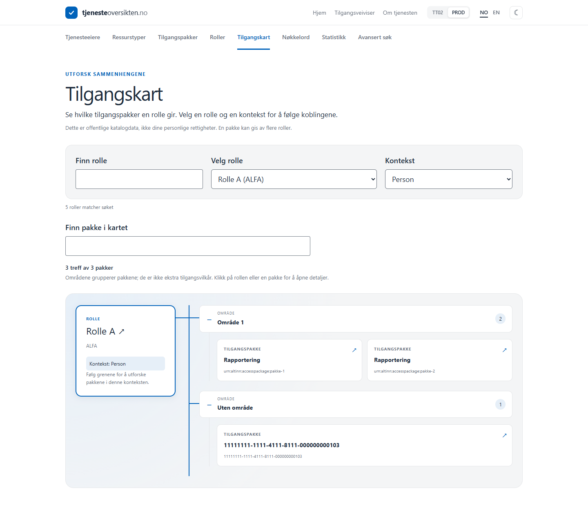

# Referanseforsøk 01: spesifikasjonsdrevet utvikling

**Første forsøk, 2026-09-08.** Case: [Tilgangskart, issue #29](https://github.com/Altinn/tjenesteoversikten.no/issues/29).
Formålet er å ha et etterprøvbart eksempel på bruk av GitHub Spec Kit i et eksisterende prosjekt.
Dette er én observasjon, ikke en sammenlignende studie eller dokumentasjon på tidsbesparelse.

## Dokumenter og sporbarhet

| Trinn | Artefakt | Hva den dokumenterer |
| --- | --- | --- |
| Prosjektprinsipper | [constitution.md](../../.specify/memory/constitution.md) | Proxygrenser, miljø, kontrakter, eksisterende frontend og verifikasjon |
| Specify | [spec.md](spec.md), [kravsjekkliste](checklists/requirements.md) | Fire brukerhistorier, 14 funksjonskrav og seks akseptansekriterier |
| Plan | [plan.md](plan.md), [research.md](research.md) | Arkitektur og begrunnede tekniske valg |
| Kontrakter | [datamodell](data-model.md), [API](contracts/role-package-map-api.md), [UI](contracts/access-map-ui.md) | Tilstander, endepunkter, interaksjon og feilhåndtering |
| Tasks | [tasks.md](tasks.md), GitHub #30–#35 | Opprinnelig 40 oppgaver fordelt på seks under-issues |
| Analyze | [analysis.md](analysis.md) | To uklarheter identifisert før implementering |
| Implement | [kode](../../src/AltinnServiceCatalogue/), [quickstart.md](quickstart.md) | Kjørbar funksjon og gjenskapbare kontroller |
| Converge | Fase 8 i [tasks.md](tasks.md) | T041: miljøvalg på mobil. T042: samlet manuell akseptanse |
| Validering | [validation.md](validation.md) | Faktiske testresultater og gjenstående usikkerhet |

## Gjennomført forløp

1. Spec Kit 1.0.4 ble installert med Codex-ferdigheter, PowerShell-skript og prosjektkonstitusjon.
2. Behovet for et visuelt rolle–pakke-kart ble spesifisert og opprettet som issue #29.
3. Plan og oppgaver ble generert. Dokumentene ble først publisert som to lange issuekommentarer.
4. Etter brukerens ønske ble de 40 oppgavene organisert som sjekklister i seks faktiske under-issues med GitHub-avhengigheter.
5. Analyze fant uklarhet om bekreftet bortfalt rolle mot cachet rolleliste og om miljøbytte på detaljsiden før Back. Begge ble presisert og implementert.
6. Implement bygget funksjonen og testene. Converge fant skjult miljøvelger på mobil og gjenstående manuell akseptanse. Mobilvelgeren ble rettet.
7. Brukeren ba om å publisere alt som første referanseforsøk. Filer versjoneres sammen med koden; issue #29 blir oversikten, under-issuene viser status. Dupliserte dokumentkommentarer fjernes etter at lenkene er flyttet.

Punktene er en oppsummering av den observerte arbeidsflyten. Git-historikken inneholder
ikke en separat commit for hvert av de tidlige trinnene; dokumentene ble først samlet
for publisering etter implementering. Den viser derfor ikke hele utviklingsforløpet trinn for trinn.

## Resultat og begrensninger

- 38 av 42 oppgaver er utført. T031, T036, T040 og T042 er åpne for menneskelig verifisering.
- 36 backendtester og 20 nettlesertester bestod lokalt. Release-bygg og frontend lint/build bestod.
- 200 pakker i 20 områder ble kontrollert ved 360 og 1440 px, med pakkesøk under ett sekund.
- Testene bruker syntetiske svar; dette er ikke en live-verifikasjon av Altinn-data.
- Faktisk skjermleserprøve, fysisk berøringsprøve og fempersoners brukertest er ikke gjennomført.
- CI-oppsettet er del av leveransen. Lokal validering og GitHub Actions-resultater må vurderes separat.
- API-testene hadde en observert rød/grønn-kjøring. Nettlesertestene ble utviklet sammen med koden; ikke alle fikk en separat observert rød kjøring før implementering.
- En eksplisitt ESLint-baseline inneholder 24 eksisterende feil. Bestått lint betyr ingen nye feil utover denne gjelden.
- Den første dokumentpubliseringen etter implementering ble stoppet av automatisk autorisasjonskontroll. Brukeren ga deretter eksplisitt tillatelse til samlet GitHub-publisering.
- Det er ikke målt samlet tidsbruk, kostnad eller produktivitetsgevinst. Det er heller ikke gjort sammenligning mot en kontrollgruppe.

## Visuelt resultat

Bildene viser syntetiske testdata, ikke faktiske rettigheter.



[Mobilvisning](evidence/access-map-mobile.png)

## Gjenoppta forsøket fra en ny klone

Installer avhengigheter og følg [quickstart.md](quickstart.md). Aktiv feature er et lokalt valg
og følger ikke Git. Fra reporoten i PowerShell:

```powershell
$env:SPECIFY_FEATURE_DIRECTORY = 'specs/001-role-package-map'
.specify/scripts/powershell/check-prerequisites.ps1 -Json -RequireSpec -RequireTasks -IncludeTasks
```

Skriptet lagrer valget i den Git-ignorerte .specify/feature.json. Fortsett på de åpne
akseptanseoppgavene; ikke merk de manuelle kriteriene bestått basert på automatiserte tester.
