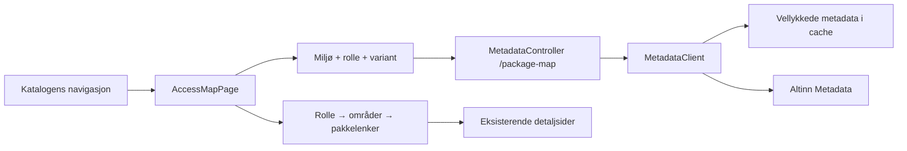

# Implementation Plan: Tilgangskart

**Branch**: `codex/001-role-package-map` (publiseringsgren) | **Date**: 2026-09-08 | **Spec**: [spec.md](spec.md)

**Issue**: [#29](https://github.com/Altinn/tjenesteoversikten.no/issues/29)

**Input**: `specs/001-role-package-map/spec.md`

**Status**: Implementert lokalt. Automatisert verifikasjon og manuell restanse er dokumentert i [validation.md](validation.md).
Spec Kits feature-identifikator er `001-role-package-map`. Planleggingen startet på den daværende arbeidsgrenen codex/localize-access-package-categories.

## Summary

Legg til en egen katalogseksjon på `/access-map`. Brukeren velger én rolle og
utforsker et visuelt tre med rollen som rot, utvidbare områdegrener og pakker som
lenker til eksisterende detaljer. Bygg treet med semantiske HTML-elementer og
CSS-forbindelser, med samme leserekkefølge og handlinger på mobil og med tastatur.

Et nytt, additivt metadata-endepunkt returnerer støttede rollekontekster og
pakkene for valgt kontekst. Kontekstlisten og pakkene har egne feilstatuser.
En separat additiv map-options-rute gir rollevalget streng feilhåndtering. Hent bare valgt konteksts pakker; ikke skann alle roller eller organisasjonsformer.
Bevar eksisterende endepunkter og gjenbruk delte rolle-/pakke-DTO-er.

## Technical Context

**Language/Version**: C# med .NET 10 (`net10.0`); TypeScript 5.9 og React 19.
Prosjektet låser ikke separat C#-språkversjon; bruk SDK-standarden.

**Primary Dependencies**: ASP.NET Core, IMemoryCache og eksisterende HttpClient
for Metadata; React Router 7, Vite 7, Tailwind 4 og Digdir Designsystemet.
Ingen ny runtime-avhengighet for graf, canvas eller layoutmotor.

**Storage**: Eksisterende minnecache, 30 minutter for vellykkede metadataoppslag.
Kartets rolle/kontekst/søk/åpne områder i sidens query-parametere. Miljø, språk og
tema følger eksisterende providere. Ingen database eller persondata.

**Testing**: Nytt fokusert .NET-testprosjekt med xUnit og
Microsoft.AspNetCore.Mvc.Testing 10.x; falsk HTTP-handler for Altinn-kall.
Playwright som devDependency for nettleserflyter med kontrollerte nettverkssvar,
Chromium i CI og manuell skjermleser-/brukerprøve. Versjoner låses i prosjektfil
og package-lock ved implementering; ingen avhengigheter installeres i planfasen.

**Target Platform**: Eksisterende webapplikasjon, Azure Windows-hosting og
moderne desktop-/mobilnettlesere. Bevar Windows utvikling og Ubuntu PR-CI.

**Project Type**: Eksisterende ASP.NET Core-proxy med React SPA.

**Performance Goals**: 200 pakker / 20 områder uten uleselig overlapp ved 360 og
1440 px; søk i innlastede data under ett sekund. Ingen krav om global rolle ×
kontekst-skanning eller alle pakker innlastet før rollevalg.

**Constraints**: Prod/TT02-isolasjon, tydelig rollekontekst, skille feil fra tomt
resultat, tastatur/berøring/skjermleser, bokmål/engelsk og begge temaer.
Webens nåværende miljøstandard beholdes; MCP-standarden `prod` endres ikke.

**Scale/Scope**: Én rolle og én kontekst om gangen. Person + organisasjonsvariantene
som dagens metadata-kilde eksponerer; ingen påstand om full dekning av alle mulige
Altinn-entitetstyper. Rolle-/pakkedetaljer gjenbrukes. Ingen delegering eller eksport.

## Constitution Check

| Prinsipp | Før research | Etter design |
| --- | --- | --- |
| I. Proxygrenser | Bestått: nettleseren bruker egen `/api` | Bestått: ny metode i eksisterende MetadataClient, tynn kontroller |
| II. Miljø | Bestått: eksisterende eksplisitte valg | Bestått: base-URL i cache-nøkler, visning/forespørsler knyttet til miljø |
| III. Kontrakter/policy | Bestått: additiv rute planlagt | Bestått: delte RoleDto/PackageDto gjenbrukes, egen envelope i Server/Models; policy/statistikk urørt |
| IV. Frontend/deploy | Bestått: eksisterende SPA og komponenter | Bestått: ny side + avgrenset navigasjonsuttrekk; samme bygg og hosting |
| V. Verifisering | Bestått: tester dimensjoneres etter feilrisiko | Bestått: ekte tester av kontrakt, feil, miljøbytte og navigasjon samt manuelle visuelle kontroller |

Ingen prinsipielle avvik krever unntak. Nåværende CI har bygg, men ikke de nye
testene; implementeringen skal koble de relevante testene inn i PR-workflowen.

## Project Structure

### Documentation (this feature)

```text
specs/001-role-package-map/
├── spec.md
├── checklists/requirements.md
├── plan.md
├── research.md
├── data-model.md
├── contracts/
│   ├── role-package-map-api.md
│   └── access-map-ui.md
└── quickstart.md
```

Oppgavene og faktisk status finnes i tasks.md.

### Source Code (repository root)

Planlagt plassering; nye filer nedenfor eksisterer først etter implementering:

```text
src/AltinnServiceCatalogue/
├── AltinnServiceCatalogue.Server/
│   ├── Controllers/MetadataController.cs             # additiv rute
│   ├── Models/RolePackageMapDto.cs                    # ny response/status
│   ├── Services/IMetadataClient.cs                    # ny metode
│   ├── Services/MetadataClient.cs                     # streng lesing + map
│   ├── Services/MemoryCacheExtensions.cs              # gjenbrukes
│   └── Program.cs                                    # test-entrypoint ved behov
├── AltinnServiceCatalogue.Server.Tests/               # nytt net10.0-prosjekt
│   ├── RolePackageMapTests.cs
│   └── MetadataMapEndpointTests.cs
├── altinnservicecatalogue.client/
│   ├── src/
│   │   ├── App.tsx
│   │   ├── components/CatalogueNavigation.tsx          # trekk ut eksisterende nav
│   │   ├── components/Layout.tsx
│   │   ├── pages/HomePage.tsx
│   │   ├── pages/AccessMapPage.tsx                     # ny, selvstendig side
│   │   ├── components/access-map/RolePackageTree.tsx
│   │   ├── hooks/useRolePackageMap.ts
│   │   ├── accessMap.ts                               # gruppering/query/state
│   │   ├── types.ts
│   │   ├── helpers.tsx                                # valgfritt signal på helpers
│   │   ├── lang.tsx
│   │   └── access-map.css
│   ├── e2e/access-map.spec.ts
│   ├── e2e/fixtures/access-map.ts
│   ├── playwright.config.ts
│   └── package.json / package-lock.json
└── AltinnServiceCatalogue.slnx                        # inkluder testprosjekt
.github/workflows/ci.yml                               # faktiske teststeg
```

**Structure Decision**: Kartet monteres ikke inne i dagens HomePage, som henter
flere urelaterte datasett ved lasting. Trekk bare katalogens navigasjon ut i en
delt komponent og bevar eksisterende ruter, navn, utvalg og styling. Bruk den
også på den nye siden. Serveren beholder nåværende tjenestegrenser.

## Phase 0 — Research decisions

Se [research.md](research.md) for bevisgrunnlag, valg og forkastede alternativer.
Avklart: datakontekster, feilmodell, cache, navigasjon, tilgjengelig tre,
oversettelser, detaljlenker og teststrategi. Ingen åpne produktavklaringer.

## Phase 1 — Design



- [Datamodell og tilstandsoverganger](data-model.md).
- [HTTP-kontrakt og feilhåndtering](contracts/role-package-map-api.md).
- [Visuelt uttrykk, interaksjon og navigasjon](contracts/access-map-ui.md).
- [Oppstart, testkommandoer og akseptansescenarioer](quickstart.md).

### Kravdekning

| Krav | Designansvar | Hovedverifisering |
| --- | --- | --- |
| FR-001–002 | CatalogueNavigation, App, rollevalg | Direkte adresse + alle eksisterende kataloglenker |
| FR-003, FR-009 | RolePackageTree, områdegruppering | Store trær, lange navn, manglende område |
| FR-004–005 | Streng map-metode og identitetsmodell | Kontekster med person-treff, duplikater, like navn |
| FR-006–007 | Eksisterende detaljer + query-tilstand | Rolle/pakke/back, miljø beholdes |
| FR-008 | Lokal filtrering med bevart rot | Treffantall, null treff, tøm/bytt rolle |
| FR-010–011 | Envelope-status, avbrytelse og nøkkelvern | Feil ≠ tomt, forsinkede svar, invalidert valg |
| FR-012–013 | Semantisk DOM, CSS, språkhelpers | Tastatur, mobil, skjermleser, begge tema/språk |
| FR-014 | Forklaring og grupperingsetiketter | Brukerprøve og innholdsgjennomgang |

## Delivery and validation boundaries

Implementer kontrakt og målrettede tester, deretter side/navigasjon og visuelt tre,
så returtilstand og de kontrollerte nettleserscenarioene. Detaljerte oppgaver
kommer fra `$speckit-tasks`; gjennomfør `$speckit-analyze` før implementering.

Planfasen endrer ingen applikasjonskode, oppretter ingen PR og kjører ikke
akseptansetester mot en ennå uimplementert funksjon. Brukerprøven med fem deltakere
må rapporteres separat; den kan ikke erstattes av en bestått automatisk test.

## Faktiske implementeringsvalg

- MetadataClient og MetadataController er partial-klasser; de nye metodene ligger i henholdsvis Services/MetadataClient.RolePackageMap.cs og Controllers/MetadataController.RolePackageMap.cs. Dette holder den additive kartflyten adskilt fra eksisterende metoder i samme tjeneste/kontroller.
- Historikkoppføringen lagrer accessMapEnv som sammenligningsmarkør, uten å overstyre EnvProvider eller lagre metadata. Bekreftet role_not_found håndteres også når rollelistecachen fortsatt inneholder rollen.
- Mobilvisningen har eget miljøvalg mot samme EnvProvider fordi eksisterende header skjuler miljøknappene ved liten bredde.
- Playwright kjører Vite på testport 64498 for å unngå brukerens vanlige devserver. CI bruker Chromium; lokal testkjøring kan bruke PW_CHANNEL=msedge.
- ESLint-baselinen registrerer 24 eksisterende feil, verifisert mot HEAD før endringen. Ingen av de nye kartfilene er undertrykt. CI kjører full lint og stopper nye regelbrudd.