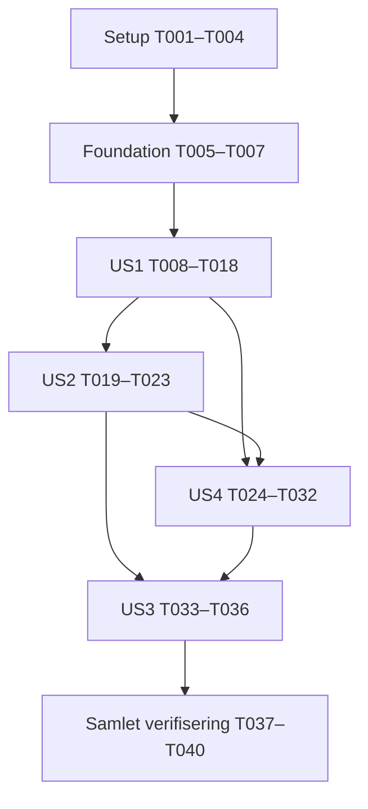

# Tasks: Tilgangskart for roller og tilgangspakker

**Issue**: [#29](https://github.com/Altinn/tjenesteoversikten.no/issues/29)
**Input**: Design documents from `specs/001-role-package-map/`
**Created**: 2026-09-08
**Status**: Implementering og automatiserte tester utført lokalt; manuell akseptanse gjenstår. Se validation.md.

**Prerequisites**: [plan.md](plan.md), [spec.md](spec.md), [research.md](research.md),
[data-model.md](data-model.md), [API-kontrakt](contracts/role-package-map-api.md),
[UI-kontrakt](contracts/access-map-ui.md) og [quickstart.md](quickstart.md).
Les også `.specify/memory/constitution.md` før implementering.

**Tests**: Oppgavene konkretiserer spesifikasjonens akseptansescenarioer og
SC-001–SC-006 gjennom teststrategien i planen: xUnit/WebApplicationFactory,
Playwright med syntetiske svar og manuelle brukbarhets-/skjermleserprøver.
Skriv de angitte historietestene før implementeringen de verifiserer og kontroller
at de feiler på manglende atferd, ikke på ødelagt testoppsett. Testresultater og
manuelle observasjoner skal registreres; oppgavegenerering betyr ikke beståtte tester.

**Organization**: Faser i prioritetsrekkefølge US1 (P1), US2 (P1), US4 (P1), US3 (P2).
US-numrene beholdes fra spesifikasjonen. Flere historier utvider samme kart;
avhengighetene beskrives eksplisitt fremfor å late som at alle kan bygges isolert.

## Format: `[ID] [P?] [Story] Description`

- Alle implementeringsoppgaver har unik sekvensiell T-id, avkryssing og konkrete filer.
- `[P]` angir arbeid i andre filer som kan utføres samtidig etter oppgitte
  forutsetninger; det gir ikke tillatelse til å hoppe over avhengigheter.
- `[US1]`–`[US4]` viser hvilken brukerhistorie oppgaven tilhører.
- Filstier nedenfor er relative til reporoten. Nye filer opprettes ved implementering.
- Kjør kommandoene i quickstart; registrer faktiske resultater i den nye filen
  `specs/001-role-package-map/validation.md`. Ikke legg testlogger med lokale data i Git.

## Phase 1: Setup (Shared Infrastructure)

**Purpose**: Gjøre planens testverktøy og kontrollerte testdata tilgjengelige.
Ingen ny database, innlogging eller grafavhengighet skal opprettes.

- [X] T001 [P] Opprett net10.0-testprosjekt med xUnit og Microsoft.AspNetCore.Mvc.Testing 10.x i `src/AltinnServiceCatalogue/AltinnServiceCatalogue.Server.Tests/AltinnServiceCatalogue.Server.Tests.csproj`, referer serveren og registrer prosjektet i `src/AltinnServiceCatalogue/AltinnServiceCatalogue.slnx`; lås valgte pakkeversjoner.
- [X] T002 [P] Legg til Playwright som devDependency i `src/AltinnServiceCatalogue/altinnservicecatalogue.client/package.json` og oppdater `src/AltinnServiceCatalogue/altinnservicecatalogue.client/package-lock.json`; opprett `src/AltinnServiceCatalogue/altinnservicecatalogue.client/playwright.config.ts` med Chromium, lokal Vite-webServer, testlokal aksept av utviklingssertifikat og trace/skjermbilde ved feil.
- [X] T003 [P] Etter T001: opprett falsk Metadata-HTTP-handler og WebApplicationFactory i `src/AltinnServiceCatalogue/AltinnServiceCatalogue.Server.Tests/Fixtures/MetadataTestFactory.cs`, med tellere, kontrollerte forsinkelser og støtte for avbrytelse; eksponer test-entrypoint minimalt i `src/AltinnServiceCatalogue/AltinnServiceCatalogue.Server/Program.cs` ved behov, og avvis alle uventede upstream-kall.
- [X] T004 [P] Etter T002: opprett rolle A–D, 200-pakkersrollen, rollekontekster, duplikater, like navn, manglende område/tekst og kontrollerte feil i `src/AltinnServiceCatalogue/altinnservicecatalogue.client/e2e/fixtures/access-map.ts`; sett miljø deterministisk per test og intercept alle `/api`-kall, også HomePage-/detaljavhengigheter, uten levende Altinn-kall.

**Checkpoint**: Testverktøy kan starte; fixtures er syntetiske. T001/T002 kan
kjøres samtidig; deretter T003/T004. Installer bare utviklingsavhengighetene planen angir.

## Phase 2: Foundational (Blocking Prerequisites)

**Purpose**: Felles kontrakttyper og språkgrunnlag før de konkrete brukerflytene.
Hele denne fasen fullføres før US1.

- [X] T005 [P] Definer RolePackageMapDto, kontekst- og selection-statuser samt stabile feilkoder i `src/AltinnServiceCatalogue/AltinnServiceCatalogue.Server/Models/RolePackageMapDto.cs` og kontrakten for GetRoleMapOptionsAsync/GetRolePackageMapAsync i `src/AltinnServiceCatalogue/AltinnServiceCatalogue.Server/Services/IMetadataClient.cs`; gjenbruk delte RoleDto/PackageDto, nullable packages/count ved feil og streng camelCase/string-status-serialisering uten å endre eksisterende signaturer; legg til tydelig uimplementerte, kompilerbare metodekropper som kaster NotImplementedException i `src/AltinnServiceCatalogue/AltinnServiceCatalogue.Server/Services/MetadataClient.cs` frem til T010/T011, slik at kontrakttestene ikke stopper på manglende grensesnittimplementering.
- [X] T006 [P] Speil transportmodellens unioner/nullregler i `src/AltinnServiceCatalogue/altinnservicecatalogue.client/src/types.ts` og definer AccessMapViewState/område-/bladtyper i `src/AltinnServiceCatalogue/altinnservicecatalogue.client/src/accessMap.ts`, inkludert role, variant, q, repeated open og expanded=custom; legg bare typer her, konkret gruppering og URL-atferd følger i historiene.
- [X] T007 [P] Legg til bokmål/engelsk `accessMap.*`-tekster i `src/AltinnServiceCatalogue/altinnservicecatalogue.client/src/lang.tsx` for seksjon, kontroller, personkontekst, gruppering, lastestatus, foreløpige tall, retry, ugyldige valg og forklaringen om katalogkoblinger fremfor personlig tilgang.

**Checkpoint**: Felles formater samsvarer med kontraktene. Midlertidige signaturer
kobles til reell implementering i T010–T012 før funksjonen kjøres; ingen dummy-svar
skal presenteres som ferdig funksjonalitet.

## Phase 3: User Story 1 — Forstå pakkene en rolle gir (Priority: P1)

**Goal**: Egen seksjon, søkbart rollevalg, kontekstvalg og korrekt visuelt tre med
områdegrupper og antall. Dette er første demonstrerbare del av funksjonen.

**Independent Test**: Velg A/person og alternativ kontekst, sammenlign med fixture,
bytt til B og C, og bekreft identitet, gruppetall og tomtilstand for D. Åpne også
seksjonen direkte. Krever ikke US3s pakkesøk eller US2s returgjenoppretting.

### Tests for User Story 1

- [X] T008 [P] [US1] Skriv kontrakttester i `src/AltinnServiceCatalogue/AltinnServiceCatalogue.Server.Tests/MetadataMapEndpointTests.cs` for map-options og package-map: gyldig rolle, korrekt valgt variant, person + dedupliserte subtypekoder også ved person-treff, komplette tomme lister, pakkeidentitet og HTTP400 for ugyldig id/miljø/variant; kontroller at ukjent API-id ikke returnerer SPA-HTML.
- [X] T009 [P] [US1] Skriv Playwright-scenarioer i `src/AltinnServiceCatalogue/altinnservicecatalogue.client/e2e/access-map.spec.ts` for direkte inngang/kataloglenke, ingen automatisk valgt rolle, søk på rollenavn/kode, kontekstbytte, områdegrupper/antall, delte pakker, like navn, manglende område og bekreftet tom rolle; bruk fixtures fra T004.

### Implementation for User Story 1

- [X] T010 [P] [US1] Implementer strenge interne metadata-lesesteg og GetRoleMapOptionsAsync i `src/AltinnServiceCatalogue/AltinnServiceCatalogue.Server/Services/MetadataClient.cs`: valider array/null/elementidentitet, ett enkeltrolle-resultat med etterspurt GUID, []/404 som bekreftet manglende rolle, og subtypekoder med samme tegn-/lengderegler som variant-input; gjenbruk URL-bygging og Metadata-klienten, men ikke legacy `?? []` eller FirstOrDefault som validering.
- [X] T011 [US1] Implementer GetRolePackageMapAsyncs vellykkede flyt i `src/AltinnServiceCatalogue/AltinnServiceCatalogue.Server/Services/MetadataClient.cs`: rolle/katalog parallelt (maks to kall), normaliser og dedupliser person + subtypekoder, valider valgt variant før ett pakkeoppslag med includeResources=false, dedupliser på pakke-id og monter komplett envelope; feil må forplantes fremfor å bli tomme suksesser inntil den fulle delstatusflyten i T026 er på plass.
- [X] T012 [US1] Legg til de to additive GET-rutene og input-/ProblemDetails-håndtering i `src/AltinnServiceCatalogue/AltinnServiceCatalogue.Server/Controllers/MetadataController.cs`: map-options og roles/{id}/package-map med tekst-id + Guid.TryParse, default person, eksplisitt validering og kontraktens 400/404/502/504; bind til eksisterende miljøkonfigurasjon, og bevar eldre ruter/responser.
- [X] T013 [P] [US1] Implementer deduplisert områdemodell og deterministisk språkbasert sortering i `src/AltinnServiceCatalogue/altinnservicecatalogue.client/src/accessMap.ts`: gruppe på område-id, ungrouped-reserve, første gyldige metadata ved samme pakke-id og stabil id som tie-breaker; bevar pakker med manglende navn og skill like navn med id/URN.
- [X] T014 [US1] Opprett `src/AltinnServiceCatalogue/altinnservicecatalogue.client/src/components/access-map/RolePackageTree.tsx` med fremhevet rollenode, nestede område-/pakkelister, navngitte noder og native utvid/skjul-knapper med aria-expanded/aria-controls; pakkene har stabile id-er og grupper viser totalt antall. Detaljlenker kobles ferdig i US2.
- [X] T015 [US1] Lag det visuelle treet i `src/AltinnServiceCatalogue/altinnservicecatalogue.client/src/access-map.css` med markert rot, stamme/områdegrener og pakkekort i normal dokumentflyt; gjenbruk tema-tokens, bryt lange navn og bruk vertikal mobilstruktur uten canvas, posisjonerte grafnoder eller nye runtime-avhengigheter.
- [X] T016 [US1] Opprett `src/AltinnServiceCatalogue/altinnservicecatalogue.client/src/hooks/useRolePackageMap.ts` med map-options og valgt map-kall, lastestatus, AbortController og nøkkel `(env, roleId, variant)` + sekvensvern ved svar/render; bevar eksisterende EnvProvider og avvis malformed klientrespons fremfor å vise tomt resultat.
- [X] T017 [US1] Opprett `src/AltinnServiceCatalogue/altinnservicecatalogue.client/src/pages/AccessMapPage.tsx` med forklaring, tekstfilter + native rolle-select, eksplisitt kontekst-select, kart og komplett tomtilstand; alternativ kontekst skal kunne velges også ved person-treff, og ufullstendige/feilede data må ikke vises som en komplett oversikt.
- [X] T018 [US1] Trekk eksisterende kataloglenker ut til `src/AltinnServiceCatalogue/altinnservicecatalogue.client/src/components/CatalogueNavigation.tsx`, bruk dem i `src/AltinnServiceCatalogue/altinnservicecatalogue.client/src/pages/HomePage.tsx` og `src/AltinnServiceCatalogue/altinnservicecatalogue.client/src/pages/AccessMapPage.tsx`, registrer /access-map i `src/AltinnServiceCatalogue/altinnservicecatalogue.client/src/App.tsx` og oppdater sidebreddeklassifiseringen i `src/AltinnServiceCatalogue/altinnservicecatalogue.client/src/components/Layout.tsx`; bevar /-alias og aktive lenker uten å laste HomePages urelaterte datasett i kartet.

**Checkpoint**: T008/T009 lykkes for US1; dokumenter resultat i validation.md.
Denne delen er en lokal demonstrasjon av kjernen. US2 og US4 kreves også før
P1-omfanget er levert; feil-/tilgjengelighetskrav skal ikke fravikes for en MVP.

## Phase 4: User Story 2 — Gå fra kart til detaljer og tilbake (Priority: P1)

**Goal**: Riktig detaljnavigasjon og gjenoppretting av alle fire utforskingsvalg.

**Independent Test**: Åpne rolle og pakke og gå Back etter hvert besøk. Bruk en
kart-URL med q og explicit expanded=custom uten open for å teste at søkeverdien
og et helt lukket tre overlever, også før US3 kobler på selve søkefeltet.

### Tests for User Story 2

- [X] T019 [US2] Utvid `src/AltinnServiceCatalogue/altinnservicecatalogue.client/e2e/access-map.spec.ts` med rolle-/pakkenavigasjon, URN-slug og GUID-fallback, manglende detaljobjekt, samme miljø og Back-gjenoppretting av role/variant/q/open; test alle-lukket separat fra førstegangsstandard, og at områdeutvidelse ikke navigerer.

### Implementation for User Story 2

- [X] T020 [P] [US2] Implementer URL-dekoding/koding og atomiske tilstandsoppdateringer i `src/AltinnServiceCatalogue/altinnservicecatalogue.client/src/accessMap.ts`: valider role, default variant, ignorer ukjente parametere, repeated open og expanded=custom, tøm q/open ved rolle-/kontekstbytte og bevar q ved lesing av historikk.
- [X] T021 [P] [US2] Koble rollenavnet til /role/{id} og pakkeløvene til eksisterende packagePath(pkg) i `src/AltinnServiceCatalogue/altinnservicecatalogue.client/src/components/access-map/RolePackageTree.tsx`; bruk vanlige lenker uten pkg/role-seed i location.state, og behold separate knapper for områdeutvidelse.
- [X] T022 [US2] Koble URL-tilstanden til `src/AltinnServiceCatalogue/altinnservicecatalogue.client/src/pages/AccessMapPage.tsx` med én replace-oppdatering per kartinteraksjon og vanlig push for detaljlenker; rehydrer valg ved tilbakekomst, og fjern ukjente åpningsnøkler først når kartets data er validert.
- [X] T023 [US2] Kjør US2-scenarioene fra `src/AltinnServiceCatalogue/altinnservicecatalogue.client/e2e/access-map.spec.ts` og registrer rolle-/pakkeadresser, miljø og Back-resultater i `specs/001-role-package-map/validation.md`; en q-verdi injisert i URL testes nå, og den reelle søkeflyten kontrolleres igjen i T036 etter US3.

**Checkpoint**: Navigasjon er et fullstendig tillegg til US1; ingen endring av
global miljøstandard eller bred omskriving av detaljsidene inngår.

## Phase 5: User Story 4 — Ulike enheter og datatilstander (Priority: P1)

**Goal**: Pålitelig kart ved feil/bytter og full tilgang med tastatur, mobil og
skjermleser. Hovedinnholdet må kunne forstås uten å se forbindelseslinjene.

**Independent Test**: Gjenta rolle-/kontekstvalg med uavhengig katalog-/pakkefeil,
forsinkede svar og miljøbytte. Gjennomfør treets kontroller og lenker uten mus,
med berøring og faktisk skjermleser. US3-pakkesøk omfattes av sluttkontrollen.

### Tests for User Story 4

- [X] T024 [P] [US4] Opprett `src/AltinnServiceCatalogue/AltinnServiceCatalogue.Server.Tests/RolePackageMapTests.cs` med statusmatrisen, null/204/malformed JSON/ugyldige id-er, feil eller flere roller i enkeltoppslag, ugyldige subtypekoder, upstream-timeout vs klientavbrytelse, retry etter feil, 30-minutters cache, samtidige like kall og cacheisolasjon på miljø/rolle/variant; utvid `src/AltinnServiceCatalogue/AltinnServiceCatalogue.Server.Tests/MetadataMapEndpointTests.cs` for wire-status/null/count og saniterte ProblemDetails.
- [X] T025 [P] [US4] Utvid `src/AltinnServiceCatalogue/altinnservicecatalogue.client/e2e/access-map.spec.ts` med lasting vs tomt, partial/failed/unavailable, retry, ugyldige valg etter miljøbytte, sene rolle-/variant-/miljøsvar, malformed respons og forsinket enrichment; kontroller ingen frame med utdaterte gjeldende data, samt fokus, skjulte lenker, mobil, tema og språk.

### Implementation for User Story 4

- [X] T026 [US4] Fullfør separate katalog-/selection-statuser, person-reserve og ikke-person unavailable i `src/AltinnServiceCatalogue/AltinnServiceCatalogue.Server/Services/MetadataClient.cs`; cache bare strengt validerte suksessdeler i 30 minutter med eksisterende `src/AltinnServiceCatalogue/AltinnServiceCatalogue.Server/Services/MemoryCacheExtensions.cs`, egne map-nøkler og coalescing; monter envelope utenfor cache, forplant klientavbrytelse, skill upstream-timeout og bevar kontraktens HTTP200 partial/failed med gyldig rolle. Fullfør responsmapping i `src/AltinnServiceCatalogue/AltinnServiceCatalogue.Server/Controllers/MetadataController.cs` uten rå exceptiontekst.
- [X] T027 [US4] Fullfør invalidert valg- og retry-livssyklus i `src/AltinnServiceCatalogue/altinnservicecatalogue.client/src/hooks/useRolePackageMap.ts`: rollelisten og map-data skal ha miljønøkkelvern, bytte skal avbryte gamle kall og umiddelbart skjule feil nøkkel, og bare komplett katalog eller bekreftet role_not_found kan erklære rollen ugyldig (variant krever komplett katalog); nettverksfeil må ikke trigge person-fallback som om valget var ugyldig.
- [X] T028 [US4] Presenter alle statusene og tydelige prøv-igjen-handlinger i `src/AltinnServiceCatalogue/altinnservicecatalogue.client/src/pages/AccessMapPage.tsx`: foreløpige tall ved partial, ingen endelig nullmelding ved ufullstendig data, behold gyldig rot, håndter bortfalt rolle/variant med beskjed, og nullstill pakkesøk/åpningsvalg ved faktisk miljøbytte uten å ødelegge Back-gjenoppretting ved remount.
- [X] T029 [US4] Koble valgfri bilingual pakkeberiking og tekstfallback inn i `src/AltinnServiceCatalogue/altinnservicecatalogue.client/src/hooks/useRolePackageMap.ts` og `src/AltinnServiceCatalogue/altinnservicecatalogue.client/src/helpers.tsx`; utvid eventuelle helpers med bakoverkompatibelt optional AbortSignal, beskytt sene svar med samme datanøkkel, behold koblinger/identitet/stabile grupper og kildenavn ved eksportfeil, og bruk accessMap.*-tekster i `src/AltinnServiceCatalogue/altinnservicecatalogue.client/src/pages/AccessMapPage.tsx`.
- [X] T030 [US4] Fullfør tastatur-/skjermlesersemantikk, live-status, synlig fokus og berøringskontroller i `src/AltinnServiceCatalogue/altinnservicecatalogue.client/src/components/access-map/RolePackageTree.tsx` og `src/AltinnServiceCatalogue/altinnservicecatalogue.client/src/pages/AccessMapPage.tsx`, samt 360/1440-layout, tema-kontrast og reduced-motion i `src/AltinnServiceCatalogue/altinnservicecatalogue.client/src/access-map.css`; bruk samme DOM for synlig tre og tilgjengelig innhold, uten role=tree eller nødvendig hover/dra-bevegelse.
- [ ] T031 [US4] Gjennomfør manuell tastatur-, berørings- og faktisk skjermleserprøve for rollevalg, kontekst, områdegrupper og detaljlenker som beskrevet i `specs/001-role-package-map/quickstart.md`; noter verktøy, gjennomførte handlinger og resultat i `specs/001-role-package-map/validation.md`, og la oppgaven stå åpen hvis skjermleserprøven ikke kan gjennomføres.
- [X] T032 [US4] Kjør backendens feil-/cachetester og nettleserens feil-/miljøscenarioer i `src/AltinnServiceCatalogue/AltinnServiceCatalogue.Server.Tests/RolePackageMapTests.cs`, `src/AltinnServiceCatalogue/AltinnServiceCatalogue.Server.Tests/MetadataMapEndpointTests.cs` og `src/AltinnServiceCatalogue/altinnservicecatalogue.client/e2e/access-map.spec.ts`; registrer funn og pass/fail i `specs/001-role-package-map/validation.md`, inkludert at fixturetestene ikke kalte levende Altinn.

**Checkpoint**: P1-funksjonene kan vurderes samlet. Katalogfeil, tomme pakker og
manglende kontekst er adskilt. Manglende menneskelig verifisering rapporteres
som gjenstående arbeid, mens uavhengige kode-/testoppgaver fortsetter.

## Phase 6: User Story 3 — Finne frem i store trær (Priority: P2)

**Goal**: Pakkenavnsøk, korrekt treffantall og lesbar utforsking av 200 pakker.
Rollesøket fra US1 beholdes; dette er utvidelsen av søk i valgt rolles tre.

**Independent Test**: Søk etter en kjent pakke i et lukket område i den store
rollen, åpne detaljer, gå tilbake og tøm søket; kontroller treff, totaler,
rotforbindelse, manuelle åpningsvalg og under ett sekund til oppdatert resultat.

### Tests for User Story 3

- [X] T033 [US3] Utvid `src/AltinnServiceCatalogue/altinnservicecatalogue.client/e2e/access-map.spec.ts` med pakkesøk på lokalisert navn, case/whitespace, null treff, treff i lukket område, tøm/rolle-/kontekstbytte, total vs treffantall, Back etter et faktisk søk og lesbarhet på 200-pakkersfixturen fra `src/AltinnServiceCatalogue/altinnservicecatalogue.client/e2e/fixtures/access-map.ts`.

### Implementation for User Story 3

- [X] T034 [US3] Implementer lokal pakkenavnsfiltrering og avledet gruppe-/treffmodell i `src/AltinnServiceCatalogue/altinnservicecatalogue.client/src/accessMap.ts`: trim og case-insensitivt søk i valgt språks navn med fallback, bevar rot/område for treff, og åpne treffområder uten å overskrive manuelt lagret open-valg eller endre totalgrunnlaget.
- [X] T035 [US3] Koble navngitt pakkesøk, q-synkronisering, tøm-handling og treff-/tomtekst inn i `src/AltinnServiceCatalogue/altinnservicecatalogue.client/src/pages/AccessMapPage.tsx` og `src/AltinnServiceCatalogue/altinnservicecatalogue.client/src/components/access-map/RolePackageTree.tsx`; bevar hele navn, kjente/foreløpige tall ved partial og riktig manuell utvidelse når søket tømmes.
- [ ] T036 [US3] Kjør søke-/tilbakescenarioene i `src/AltinnServiceCatalogue/altinnservicecatalogue.client/e2e/access-map.spec.ts` og mål SC-003 på 360/1440 px med 200 pakker/20 områder; gjenta tastatur/berøring/skjermleser for det nye søkefeltet og lagre ytelsesresultat, visuell kontroll og eventuelle gjenstående manuelle prøver i `specs/001-role-package-map/validation.md`.

**Checkpoint**: Alle fire historier har komplette funksjonelle scenarioer.
Oppgaven med skjermleserkrav er ikke ferdig før prøven faktisk er utført.

## Phase 7: Polish & Cross-Cutting Concerns

**Purpose**: Samlet regresjonskontroll, CI, dokumentasjon og målbar brukeraksept.

- [X] T037 [P] Koble faktiske .NET-tester, frontend-lint og Playwright Chromium inn i `.github/workflows/ci.yml` etter installasjon/bygg, med Linux browser dependencies, trace-/skjermbildeartefakter ved feil og uten å fjerne eksisterende bygg/artefakter eller endre deploy-workflowen.
- [X] T038 [P] Oppdater inngang/bruksbeskrivelse i `README.md` og gjenskapbare kommandoer, fixtureforutsetninger og observasjoner i `specs/001-role-package-map/quickstart.md` slik at de samsvarer med ferdig implementering; oppdater `specs/001-role-package-map/plan.md` bare dersom konkrete fil-/designvalg har endret seg, og legg ikke til funksjoner utenfor issue #29.
- [X] T039 Kjør hele solution-builden, frontend-lint/build, .NET-testprosjektet og samtlige kartnettleserscenarioer etter `specs/001-role-package-map/quickstart.md`; kontroller eksisterende katalogruter, rolle-/pakkedetaljer og miljøvalg, og skriv en samlet FR-001–FR-014/SC-002–SC-006-resultatoversikt med faktiske kommandoer og eventuelle begrensninger i `specs/001-role-package-map/validation.md`.
- [ ] T040 Gjennomfør SC-001 med fem representative førstegangsbrukere etter protokollen i `specs/001-role-package-map/quickstart.md` og registrer anonymiserte tider, forståelse og resultat i `specs/001-role-package-map/validation.md`; minst fire skal lykkes innen 60 sekunder. Hvis deltakere mangler, dokumenter dette og la oppgaven være uavkrysset i `specs/001-role-package-map/tasks.md` fremfor å anta bestått.

## Dependencies & Execution Order

### Phase Dependencies

US4 bruker retur-/query-integrasjonen fra US2 når valg valideres ved miljøbytte.
US3 bygger på samme tilstand og må bevare US4s feilmeldinger og tilgjengelighet.
De kan kontrolleres som egne brukerflyter med fixtures, men ikke implementeres
samtidig uten koordinering i felles filer. Standard utføring er derfor fasevis.

### Within Each User Story

- T008/T009 før US1-implementering. T010 → T011 → T012 er backend-kjeden.
- T013 etter foundation, deretter T014 → T015. T016 kan lages mot låst kontrakt,
  men live-integrasjonen i T017 krever T012–T016. T018 integrerer siden i navigasjonen.
- T019 før T020/T021; T022 etter begge, så T023.
- T024/T025 før T026; deretter T027 → T028 → T029 → T030 → T031/T032.
- T033 før T034 → T035 → T036. Gjenta Back og tilgjengelighet etter at q får UI.
- T037/T038 etter kodefasene. T039 etter disse; T040 bruker verifiserbar ferdig flyt.
- Dersom en manuell prøve venter på menneskelig medvirkning, fortsett uavhengige
  oppgaver og rapporter prøven som åpen. Ingen uavkryssede akseptansemål må skjules
  når issue/implementering vurderes ferdig.

### Parallel Opportunities and Examples

Disse eksemplene beskriver muligheter ved implementering; oppgavegenereringen
starter ingen agenter eller kodearbeid.

| Fase/historie | Kan utføres samtidig | Forutsetning / grense |
| --- | --- | --- |
| Setup | T001 + T002; deretter T003 + T004 | Ulike .NET-/frontendfiler |
| Foundation | T005 + T006 + T007 | Avtalte transportnavn fra kontrakten brukes |
| US1 | T008 + T009; T010 + T013 | Testforfatting først; backend-lesing og frontend-gruppering deler ikke filer |
| US2 | T020 + T021 | T019 skrevet; URL-codec og trelenker er ulike filer, integreres i T022 |
| US4 | T024 + T025 | Backend-tester og browser-tester i ulike filer; implementering etter testene |
| US3 | Ingen trygge parallelle kodeoppgaver i foreslått oppdeling | Filtermodell → side/tre → felles test/validering; ikke parallellskriv accessMap.ts eller e2e-filen |
| Polish | T037 + T038 | CI og dokumentasjon er adskilt; samlet testkjøring etter begge |

`[P]` betyr ikke at alle merkede oppgaver kan startes samtidig på tvers av faser.
Følg de navngitte parene og avhengighetene, særlig for MetadataClient.cs,
AccessMapPage.tsx, accessMap.ts og e2e/access-map.spec.ts.

## Traceability

| Krav | Primære oppgaver |
| --- | --- |
| FR-001 | T009, T017–T018, T039 |
| FR-002 | T007, T009–T010, T017 |
| FR-003 | T013–T015, T018 |
| FR-004 | T008, T010–T012, T017, T024–T028 |
| FR-005 | T008–T014, T024 |
| FR-006 | T019, T021, T023 |
| FR-007 | T019–T023, T033, T035–T036 |
| FR-008 | T033–T036 |
| FR-009 | T014–T015, T030, T033–T036 |
| FR-010 | T010, T012, T016, T024–T028, T032 |
| FR-011 | T016, T020, T024–T029, T032 |
| FR-012 | T014, T025, T030–T031, T036 |
| FR-013 | T007, T015, T025, T029–T031, T036 |
| FR-014 | T007, T017, T038, T040 |
| SC-001 | T040 |
| SC-002 | T008, T024, T032, T039 |
| SC-003 | T033–T036 |
| SC-004 | T019–T023, T033, T036, T039 |
| SC-005 | T025, T030–T031, T036, T039 |
| SC-006 | T024–T028, T032, T039 |

## Implementation Strategy

1. Kjør `$speckit-analyze` på spec/plan/tasks før implementering.
2. Første demonstrasjon: Setup + foundation + US1. Dette viser kartets kjerne
   med ekte kontrakt og kontrollert verifisering; det er ikke hele issue #29.
3. Fullfør US2 og US4 for P1-omfanget, deretter US3 og samlet verifisering.
4. Kjør `$speckit-converge` etter implementeringen for å kontrollere resterende
   arbeid. Markering av en oppgave krever at både implementering og dens angitte
   verifisering er gjennomført.
5. Vanlig commit/PR/review følger som eget arbeid. Ingen automatisert deploy
   eller endring av personlige tilganger inngår her. Oppgavene følges i sub-issuene nedenfor.

## Generation Validation

- 40 oppgaver: Setup 4, foundation 3, US1 11, US2 5, US4 9, US3 4, polish 4.
- Alle fire brukerhistorier og FR-001–FR-014 / SC-001–SC-006 er koblet til oppgaver.
- Alle oppgaver har avkryssing, unik T-id, riktig historielabel og konkrete filstier.
- Alle oppgaver er uavkrysset; ingen tester er kjørt som del av oppgavegenereringen.
- `.specify/extensions.yml` er ikke konfigurert: ingen før-/etter-hooks kjøres.

## GitHub sub-issues

Opprettet 2026-09-08 etter brukerens ønske. Hver T-oppgave finnes i nøyaktig én
sub-issue under #29. Hold avkryssing synkronisert med denne filen ved implementering.
Plan- og oppgavekommentarene på #29 er dokumentasjonsgrunnlag; løpende status og
ansvar følges i sub-issuene.

| Sub-issue | Omfang | Oppgaver | Avhenger av |
| --- | --- | --- | --- |
| [#30](https://github.com/Altinn/tjenesteoversikten.no/issues/30) | Grunnoppsett og kontrakter | T001–T007 | Ingen |
| [#31](https://github.com/Altinn/tjenesteoversikten.no/issues/31) | US1: Visuelt tre | T008–T018 | #30 |
| [#32](https://github.com/Altinn/tjenesteoversikten.no/issues/32) | US2: Detaljnavigasjon | T019–T023 | #31 |
| [#33](https://github.com/Altinn/tjenesteoversikten.no/issues/33) | US4: Feil og tilgjengelighet | T024–T032 + T041 (lokal konvergens) | #31, #32 |
| [#34](https://github.com/Altinn/tjenesteoversikten.no/issues/34) | US3: Søk | T033–T036 | #32, #33 |
| [#35](https://github.com/Altinn/tjenesteoversikten.no/issues/35) | Samlet verifisering | T037–T040 + T042 (lokal konvergens) | #34 |

## Phase 8: Convergence

- [X] T041 Gjør miljøvelger tilgjengelig i kartets mobilvisning i `src/AltinnServiceCatalogue/altinnservicecatalogue.client/src/pages/AccessMapPage.tsx` og `src/AltinnServiceCatalogue/altinnservicecatalogue.client/src/access-map.css`, med samme EnvProvider og en berøringstest i `e2e/access-map.spec.ts`; FR-011/FR-012/FR-013 (partial, MEDIUM).
- [ ] T042 Samle faktisk skjermleser-/berøringsbevis fra T031/T036 og fempersoners brukeraksept fra T040 i `specs/001-role-package-map/validation.md`, og bekreft samlet akseptanse før #29 lukkes; SC-001/SC-005 (partial, HIGH). Eksisterende manuelle prøver skal gjennomføres én gang, ikke dupliseres.
